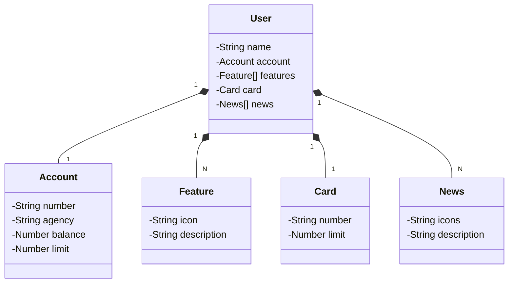

# Publicando Sua API REST na Nuvem Usando Spring Boot 3, Java 17 e Railway
Projeto Java RESTful API criada para o bootcamp "Claro - Java com Spring Boot".

## Diagrama de Classes

```mermaid
classDiagram
    class User {
        -String name
        -Account account
        -Feature[] features
        -Card card
        -News[] news
    }

    class Account {
        -String number
        -String agency
        -Number balance
        -Number limit
    }

    class Feature {
        -String icon
        -String description
    }

    class Card {
        -String number
        -Number limit
    }

    class News {
        -String icons
        -String description
    }

    User "1" *-- "1" Account
    User "1" *-- "N" Feature 
    User "1" *-- "1" Card
    User "1" *-- "N" News 
```
